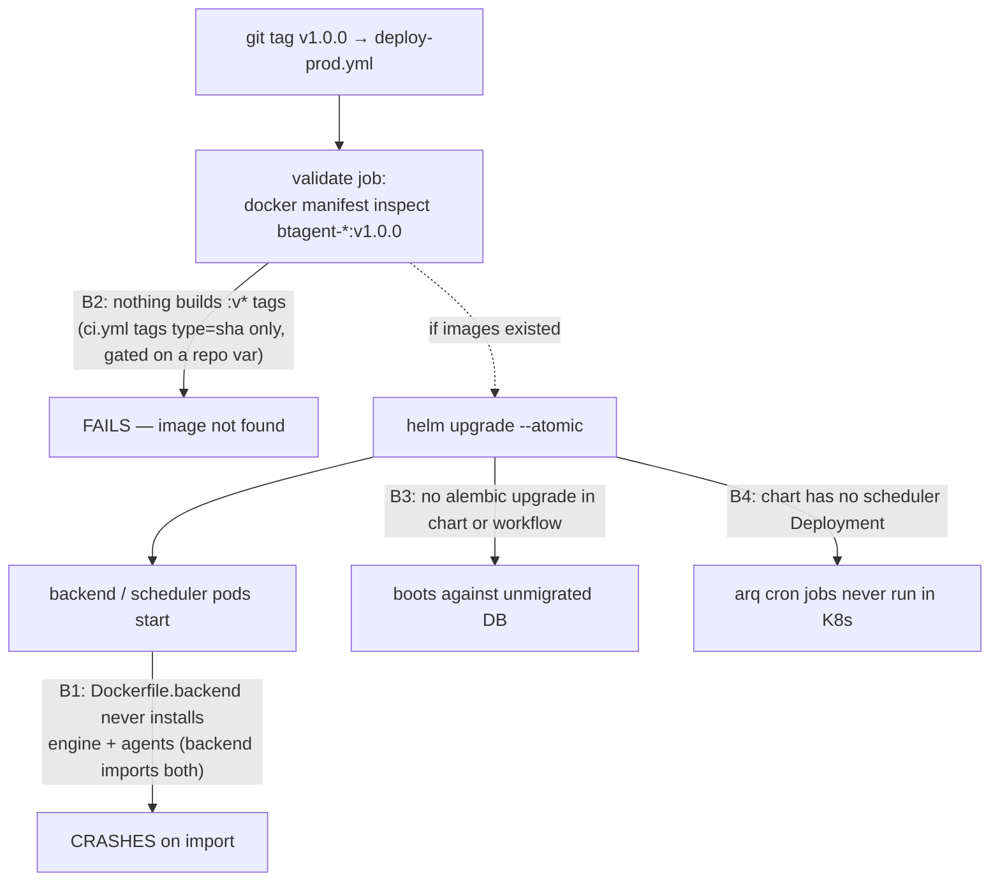

# BTagent Deployment Plan

The plan of record for getting BTagent into production and for sequencing the
remaining feature work. It has two halves:

1. **Deployment blockers** — concrete, verified gaps that mean a real
   production deploy would *not* currently succeed. These are the must-fix
   items before any go-live.
2. **Remaining roadmap** — the production-hardening and feature work
   (`docs/ROADMAP.md` v0.4 → Phase 6) that constitutes "the rest" of what ships.

Each blocker is scoped to be ownable as a single follow-up PR. This document is
a plan only — it makes no code, workflow, Helm, or Dockerfile changes itself.

> Issue references (`#NN`) come from [`ROADMAP.md`](ROADMAP.md) and
> [`PHASE6_THREAT_HUNTING_PLAN.md`](PHASE6_THREAT_HUNTING_PLAN.md), which cite
> them directly.

---

## Why the current deploy path breaks

The chart, Terraform, and deploy workflows all exist and read as complete — but
following the documented release path (`git tag v* → deploy-prod.yml`) hits four
independent failures:



---

## Section 1 — Deployment blockers (must-fix before go-live)

Severity legend: **Critical** = deploy fails or app crashes · **High** =
deploys but a core capability is silently dead or operators are locked out ·
**Medium** = operational / hardening gap.

### B1 — Production backend image is missing the agent engine *(Critical)*

**Symptom.** The backend (and scheduler) container crashes on first import of
any code path that touches the agent engine.

**Root cause.** `infra/docker/Dockerfile.backend` installs only `shared` and
`backend`:

```dockerfile
RUN cd shared && uv pip install --system -e .
...
RUN cd backend && uv pip install --system -e .
COPY agents/pyproject.toml backend/...   # copied, never installed
# engine/ is never copied or installed at all
```

But the backend imports the engine and agents packages:

| Importer | Imports |
|----------|---------|
| `backend/btagent_backend/services/{task_manager,report_service,playbook_service}.py`, `scheduler/jobs.py` | `btagent_agents` |
| `backend/btagent_backend/ws/engine_event_adapter.py`, `db/models_workflow.py` | `btagent_engine` |
| `agents/btagent_agents/orchestrator/*`, `middleware/llm_router.py` | `btagent_engine` |

`backend/pyproject.toml` only declares `btagent-shared` as a workspace dep, so
installing `backend` does **not** pull in `agents`/`engine`, and the agents'
heavy runtime deps (`langgraph`, `litellm`, `pysigma*`) are never installed.

This is invisible in CI because CI installs all four packages editable
(`ci.yml` install steps) and never runs the actual Docker image. The same image
backs the `scheduler` service in `docker-compose.yml`
(`command: ["arq", "btagent_backend.scheduler.worker.WorkerSettings"]`), so the
scheduler is broken in exactly the same way.

**Fix.** In the builder stage, install in workspace dependency order
`shared → engine → agents → backend` (mirroring the order used throughout
`ci.yml`) and `COPY engine/btagent_engine engine/btagent_engine` so the engine
source ships. Confirm a single shared image (backend + scheduler) is acceptable
versus splitting into separate backend/agent images; note the image-size
increase from the LangGraph/LiteLLM/pysigma dependency tree.

**Verify.** `docker build -f infra/docker/Dockerfile.backend -t btagent-backend:test .`
then `docker run --rm btagent-backend:test python -c "import btagent_backend, btagent_agents, btagent_engine"`.

### B2 — Nothing builds version-tagged images for production *(Critical)*

**Symptom.** `deploy-prod.yml` fails immediately at the `validate` job with
"image not found" for the tag being released.

**Root cause.** `deploy-prod.yml` triggers on `push: tags: ["v*"]` and the
`validate` job runs `docker manifest inspect <image>:<tag>` before deploying.
The only job that builds and pushes images — `build-images` in `ci.yml` —
- runs only on **push to `main`**,
- tags images **by commit SHA only** (`type=sha,prefix=`), and
- is gated behind `if: ... vars.ENABLE_IMAGE_BUILD == 'true'`.

So no artifact named `ghcr.io/.../btagent-backend:v1.0.0` is ever produced.

**Fix (choose one, document the choice).**
- **(a) Release workflow.** Add `.github/workflows/release.yml` triggered on
  `v*` tags that builds + pushes semver-tagged images, ordered *before* the
  deploy. Cleanest separation of "build release artifact" from "deploy".
- **(b) Extend `build-images`.** Add `type=semver,pattern={{version}}` /
  `type=ref,event=tag` to the metadata step and a `push: tags: ["v*"]` trigger,
  removing or keeping the `ENABLE_IMAGE_BUILD` gate as desired.

Either way, ensure the image tag the deploy resolves (`needs.validate.outputs.version`)
matches what was pushed.

**Verify.** Push a throwaway `v0.0.0-rc1` tag to a fork; confirm the build runs
and `docker manifest inspect` in `validate` passes.

### B3 — No database migration runs on deploy *(Critical)*

**Symptom.** A fresh cluster boots the backend against an empty/unmigrated
schema; existing clusters run new code against an old schema.

**Root cause.** None of `deploy-staging.yml`, `deploy-prod.yml`, or the Helm
templates run `alembic upgrade head`. The chart ships only
configmap / secret / deployment / service / ingress / hpa / pdb /
networkpolicy / serviceaccount templates — no migration Job or init container.
`DEPLOYMENT.md` describes an init container as something the chart "can include"
(it does not).

**Fix.** Add a Helm `pre-install,pre-upgrade` **hook Job**
(`templates/migrate-job.yaml`) that runs `alembic upgrade head` from the backend
image, with `helm.sh/hook-weight` so it completes before the rollout. Because
prod deploys use `--atomic`, a failed migration then rolls the release back
cleanly. For Docker Compose, make the existing `make db-migrate` step explicit
in the deploy runbook (it is currently easy to skip).

**Verify.** `helm template ... | grep -A30 'kind: Job'` shows the hook;
a clean-namespace `helm install` brings the schema up before pods go Ready.

### B4 — Helm chart has no scheduler/worker Deployment *(High)*

**Symptom.** In Kubernetes, all scheduled/background work silently never runs:
Phase 6 scheduled hunts (#112), behavioral baseline builds (#114), and the
stale-suppression re-confirmation sweep (#119).

**Root cause.** `docker-compose.yml` defines a `scheduler` service, but the Helm
`templates/deployment.yaml` ships only `backend` and `frontend` Deployments.
There is no arq worker workload in the chart.

**Fix.** Add a scheduler Deployment to the chart (same image as backend,
`command: ["arq", "btagent_backend.scheduler.worker.WorkerSettings"]`,
`envFrom` the same config/secret), with `replicaCount`/`resources` values
entries. Mirror the compose definition. Keep it a single replica (or add a
leader-election note) so cron jobs don't double-fire.

**Verify.** `helm template` renders the scheduler Deployment; in a test cluster
`kubectl logs deploy/btagent-scheduler` shows arq registering its cron jobs.

### B5 — No admin bootstrap path; `make db-seed` locks you out *(High)*

**Symptom.** After a prod `make db-seed`, no one can log in — the admin password
is random and never surfaced.

**Root cause.** `infra/scripts/seed-data.py` (SEC-002 fix) correctly generates a
random admin password in non-test mode and (correctly) does not print it, but
ships no retrieval/reset path — the code comment points operators at an "admin
CLI" that does not exist. Yet `DEPLOYMENT.md` step 5 still instructs
`make db-seed` for production.

**Fix.** Add a deterministic bootstrap: read an admin password from
`BTAGENT_SEED_ADMIN_PASSWORD` (fail loudly if unset in prod) **or** ship a
`create-admin` / `reset-password` management command. Update the prod runbook to
use it and to stop recommending `make db-seed` (which also seeds a sample
investigation) for production.

**Verify.** `BTAGENT_SEED_ADMIN_PASSWORD=… python infra/scripts/seed-data.py`
then log in via `/api/v1/auth/login` with that password.

### B6 — Staging is manual-only; no staging cluster wired *(Medium)*

**Root cause.** `deploy-staging.yml`'s `push: branches: [main]` trigger is
commented out ("Manual trigger only until staging cluster is configured") and it
depends on `secrets.KUBE_CONFIG_STAGING`.

**Fix / track.** Provision the staging cluster (Terraform already models EKS),
set the `KUBE_CONFIG_STAGING` environment secret, then re-enable the
`main`-push trigger so every merge continuously deploys to staging.

### B7 — Production hardening is documented but not default *(Medium)*

**Root cause.** `DEPLOYMENT.md` describes the prod nginx config
(HSTS / CSP / X-Frame-Options), restricted CORS, and external-secrets, but these
are manual steps; the shipped defaults are dev-grade (wildcard CORS, plain
nginx). See also `ROADMAP.md` "Known Limitations" (CORS, seed data).

**Fix / track.** Fold these into the go-live checklist below; longer term, make
the hardened nginx config and a CORS-restriction startup assertion the default
for `BTAGENT_ENV=prod`.

---

## Section 2 — Production readiness (ROADMAP v0.4 "Known Limitations")

These don't block a deploy from *standing up*, but block running it for real.
Prioritized; each links to its `ROADMAP.md` v0.4 entry.

| Priority | Item | Why it matters | Roadmap |
|----------|------|----------------|---------|
| P0 | **Real SIEM/CTI connectors (#100)** | All 9 MCP connectors are mocks (`BTAGENT_MOCK_CONNECTORS=true`); with mocks the product returns canned data. | v0.4 "Real Connector Implementations" |
| P0 | **JWT revocation + refresh rotation** | Tokens can't be revoked and refresh tokens aren't rotated — logout/compromise can't be enforced. | v0.4 "Authentication Hardening" |
| P1 | **Hardened CORS default** | Dev config uses wildcard methods/headers (ties to B7). | v0.4 + Known Limitations |
| P1 | **Deep health checks + graceful shutdown** | `/health` should verify DB/Redis/MinIO; in-flight requests should drain on rollout. | v0.4 "Operational Improvements" |
| P2 | **SSO (SAML 2.0 / OIDC), MFA (TOTP)** | Enterprise auth requirement. | v0.4 "Authentication Hardening" |
| P2 | **PDF report export** | Reports are text-only in-app today. | v0.4 "Report Export" |
| P2 | **Perf: query/index tuning, caching, bundle splitting** | High-concurrency readiness. | v0.4 "Performance Optimization" |

---

## Section 3 — Remaining roadmap features ("the issues")

### Phase 6 — Proactive Threat Hunting (#112–#121)

Condensed from [`PHASE6_THREAT_HUNTING_PLAN.md`](PHASE6_THREAT_HUNTING_PLAN.md).
The keystone is the shared `HuntFinding` contract (#119) — every hunt source
emits into it. Cross-cutting dependencies: the **arq scheduler** (#101, also
needed by B4) and **real connectors** (#100, also P0 above).

```
WAVE 0  (no new deps)   F0.1 HuntFinding + F0.3 RBAC/events + F0.4 hunt/ pkg → #119 Hunt Triage (keystone)
WAVE 1  (+arq, +pysigma) #112 Hunt Pack Runner · #114 Behavioral Hunter        → emit into #119
WAVE 2  (det-eng loop)   #113 CTI→Detection ⇄ #118 Validation · #120 Cross-Investigation
WAVE 3  (gated on #100)  #116 Identity · #117 Cloud · #121 Agentic-AI Misuse    → emit into #119
```

Recommended PR sequence (each a reviewable unit): **PR-A** F0.1+F0.3+F0.4+#119 →
**PR-B** arq scheduler (#101) → **PR-C** #112 → **PR-D** #114 → **PR-E** #120 →
**PR-F/G** #113+#118 → **PR-H/I/J** #116/#117/#121 as their #100 connectors land.

> Dependency note: PR-B (arq scheduler) and blocker **B4** (scheduler in the
> Helm chart) are the same infrastructure — land them together so scheduled
> hunts actually run in production.

### Phase 5 — Enterprise (after Phase 6 foundations)

Multi-tenancy (org-scoped isolation, per-tenant RBAC/quotas), STIX/TAXII 2.1
feed ingestion, Neo4j IOC relationship graph, cross-investigation learning,
compliance reporting. See `ROADMAP.md` v0.5.

---

## Section 4 — Sequencing & Definition of Done

### Recommended order

```
B1 → B2 → B3            deploy succeeds and the app starts (critical path)
   ↓
B4 + B5 (+ PR-B #101)   scheduler runs in K8s; an admin can log in
   ↓
B6 + B7                 continuous staging deploys; hardened defaults
   ↓
v0.4 P0/P1              real connectors, JWT revocation, deep health, CORS
   ↓
Phase 6 Waves 0→3       hunting features (PR-A … PR-J)
   ↓
Phase 5                 enterprise
```

### Definition of Done — first production deploy

- [ ] **B1** Backend image imports `btagent_agents` + `btagent_engine` (and runs).
- [ ] **B2** Tagging `vX.Y.Z` builds + pushes versioned backend/frontend images.
- [ ] **B3** `helm install/upgrade` runs `alembic upgrade head` before rollout.
- [ ] **B4** Scheduler Deployment runs in-cluster; arq cron jobs register.
- [ ] **B5** Admin can log in via a documented, non-leaking bootstrap.
- [ ] **B6** Staging cluster wired; merges to `main` deploy to staging.
- [ ] **B7** Prod nginx (HSTS/CSP), restricted CORS, external-secrets in place.
- [ ] `BTAGENT_MOCK_CONNECTORS=false` with at least one real connector (#100 P0).
- [ ] Prod smoke test (`/api/health`) green; PG backup CronJob scheduled.

---

## Section 5 — Verification (per blocker, for the follow-up PRs)

| Blocker | Verification |
|---------|--------------|
| B1 | `docker build -f infra/docker/Dockerfile.backend .` then `docker run --rm  python -c "import btagent_backend, btagent_agents, btagent_engine"`. |
| B2 | Push `v0.0.0-rc1` to a fork; confirm build runs and `deploy-prod.yml` `validate` (`docker manifest inspect`) passes. |
| B3 | `helm template infra/helm/btagent \| grep -A30 'kind: Job'`; clean-namespace install brings schema up before pods Ready. |
| B4 | `helm template` renders the scheduler Deployment; `kubectl logs deploy/btagent-scheduler` shows arq cron registration. |
| B5 | `BTAGENT_SEED_ADMIN_PASSWORD=… python infra/scripts/seed-data.py`; log in with that password. |
| B6 | Merge to `main` triggers `deploy-staging.yml`; staging smoke test green. |
| B7 | `curl -I https://<host>` shows HSTS/CSP/X-Frame-Options; cross-origin request from a non-allowed origin is rejected. |
